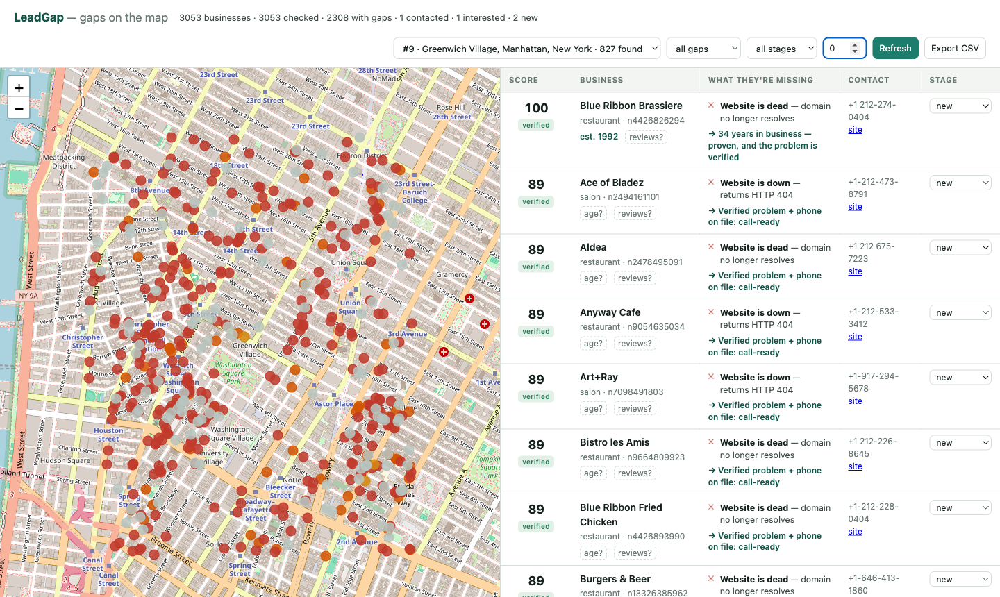
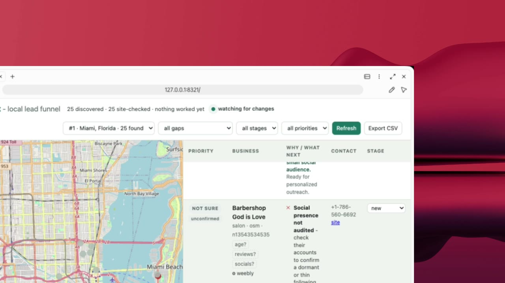
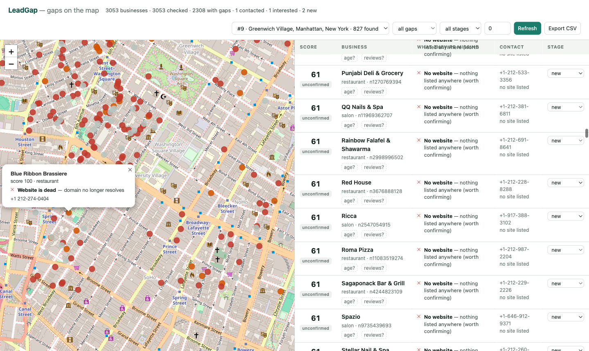
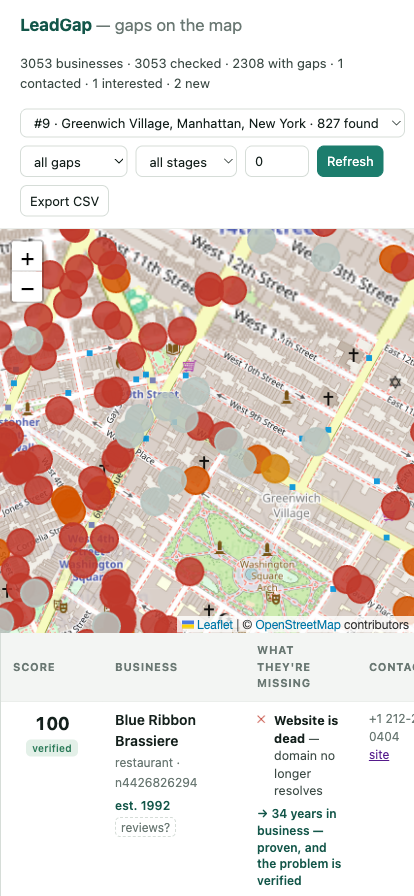

<div align="center">
  
  <h1>LeadShoot</h1>
  <p><strong>Whatever you sell to local businesses, your AI agent finds the ones that need it.</strong></p>

  <p>
    <a href="LICENSE"></a>
    
    
    
    
  </p>

  <p>
    <a href="#demo"><b>Demo</b></a> ·
    <a href="#quick-start"><b>Quick start</b></a> ·
    <a href="#-works-with-your-agent">Agents</a> ·
    <a href="#pick-your-niche">Niches</a> ·
    <a href="#how-it-works">How it works</a> ·
    <a href="#data-providers">Providers</a> ·
    <a href="INTEGRATIONS.md">Integrations</a>
  </p>

  <br/>

  <table align="center">
    <tr>
      <td align="center" width="104"><a href="https://claude.com/claude-code"></a><br/><sub><b>Claude&nbsp;Code</b></sub></td>
      <td align="center" width="104"><a href="https://openai.com/codex/"></a><br/><sub><b>Codex</b></sub></td>
      <td align="center" width="104"><a href="https://antigravity.google"></a><br/><sub><b>Antigravity</b></sub></td>
      <td align="center" width="104"><a href="https://grok.com"></a><br/><sub><b>Grok</b></sub></td>
      <td align="center" width="104"><a href="https://hermes.nousresearch.com"></a><br/><sub><b>Hermes</b></sub></td>
      <td align="center" width="104"><a href="https://openclaw.ai"></a><br/><sub><b>OpenClaw</b></sub></td>
    </tr>
  </table>

  <p><sub>JSON-first CLI · eight agent skills · five specialist agents · optional MCP server.</sub></p>

  <br/>

  
  <p><em>827 businesses in Greenwich Village, every website checked live. Red = a verified reason to call.</em></p>
</div>

## Demo

<div align="center">
  <a href="assets/leadshoot-demo.mp4">
    
  </a>
  <p><a href="assets/leadshoot-demo.mp4"><strong>▶ Watch the 37-second demo</strong></a></p>
</div>

The demo shows an agent turning a plain-English request into a local-business
search, checking the leads, and filling the live map with evidence-backed
priorities.

## Quick start

You need Python 3.11+ and [uv](https://docs.astral.sh/uv/). You do not
need to clone this repository.

### 1. Install LeadShoot

Run it on demand:

```bash
alias leadshoot='uvx --from "leadshoot[all] @ git+https://github.com/moasq/leadshoot" leadshoot'
```

Or install a permanent command:

```bash
uv tool install "leadshoot[all] @ git+https://github.com/moasq/leadshoot"
```

The first `uvx` run takes a few seconds while uv builds an isolated
environment. Later runs use the cache.

### 2. Tell it what you sell

Do this before choosing gaps yourself:

```bash
leadshoot niche "I sell bookkeeping services to independent cafés"
```

The deterministic classifier returns one of:

- `gaps`: find businesses with a problem your service fixes.
- `fit`: find healthy businesses likely to buy a product, supply, or B2B
  service.
- `clarify`: answer the listed question before creating the search.

### 3. Save one ideal customer profile

For a gap service:

```bash
leadshoot icp new \
  --name austin-dentists-web \
  --area "Austin, Texas, United States" \
  --categories dentist \
  --service website_design \
  --mode gaps \
  --provider osm \
  --json
```

For a product, supply, or B2B service:

```bash
leadshoot icp new \
  --name cambridge-cafe-bookkeeping \
  --area "Cambridge, Massachusetts, United States" \
  --categories cafe \
  --service general \
  --mode fit \
  --provider osm \
  --json
```

Use an unambiguous place name including state/province and country. If a
search returns businesses from the wrong region, correct the area and start a
new search.

### 4. Find and check businesses

```bash
leadshoot find --icp cambridge-cafe-bookkeeping --limit 25 --json
```

`find` performs discovery, checks websites concurrently, classifies the
available evidence, and creates a research queue. Large areas can take one to
three minutes.

The live map opens automatically and repaints while results arrive. Reopen it
with `leadshoot ui`; stop its background server with `leadshoot ui --stop`.
On a headless machine, add `--no-open` or set `LEADSHOOT_NO_OPEN=1`.

### 5. Resolve what is still unknown

```bash
leadshoot research-queue --search latest --json
```

Each queue item is a small, independent job: verify an aggregate review
rating, recent social activity, business age, or another fact that affects
the decision. Unknown data remains unknown—it is never silently treated as a
problem.

Record only public business facts and aggregates:

```bash
leadshoot review add <LEAD_ID> \
  --source google --rating 4.6 --count 128 \
  --url "https://public-profile.example" \
  --icp cambridge-cafe-bookkeeping --json

leadshoot signal add <LEAD_ID> \
  --key business.founded_year --source website --value 2014 \
  --url "https://business.example/about" \
  --icp cambridge-cafe-bookkeeping --json
```

The lead is reclassified after every verified signal.

### 6. Work or export the qualified leads

```bash
leadshoot leads --search latest --priority high --json
leadshoot show <LEAD_ID> --json
leadshoot mark <LEAD_ID> --stage contacted --note "Called 23 July" --json
leadshoot export --format csv --priority high --out leads.csv
```

Every search gets its own number. `--search latest` means the newest search,
not every lead ever discovered. Pipeline stages and notes are preserved
across rechecks.

LeadShoot stores state in `./leadshoot.db`. Use `--db path/to/project.db` or
`LEADSHOOT_DB` when you want separate projects instead of mixing campaigns.

Paid lead lists sell everyone the same contacts. **LeadShoot computes yours** - and it's
agent-native the way [Postiz](https://github.com/gitroomhq/postiz-app) is for social:
you tell your AI what you sell, and it runs discovery, verifies every gap against the
real world, qualifies each lead as high/medium/not sure, and works the
research queue while you keep talking.
Open data, one SQLite file, runs on a laptop.

## ✨ What it does

- ✅ **Tell it what you sell.** A deterministic niche classifier maps your words to *gap mode* (find fixable problems) or *fit mode* (find healthy buyers) - no guessing.
- ✅ **Discovery on open data.** OpenStreetMap and [Overture](https://overturemaps.org/) (~60M places) - no scraping required, no contact list to buy.
- ✅ **Evidence before priority.** Flagged sites were fetched and seen failing. Anything inferred stays `not_sure` until confirmed.
- ✅ **Useful context, not a mystery number.** Every lead says `high`, `medium`, or `not_sure`, why, what is unknown, and what to check next.
- ✅ **Bounded quick research.** `find` returns independent website/social/review/age jobs that agents can run in parallel.
- ✅ **Your pipeline stays yours.** Stages and notes live in tables no engine run ever touches.
- ✅ **A live map, hands-free.** `find` opens the map in your browser by itself and repaints it as data changes - pins land as each check commits, whether the writer is your terminal or an agent over MCP. No refresh button, no serve step.
- ✅ **One SQLite file.** No accounts, no cloud, portable - point it at your city.

## 🤖 Works with your agent

Not a SaaS with AI bolted on - a **CLI that speaks JSON**, so any agent that can run a
shell command can drive it. Say *"find cafés in Astoria with dead Instagrams"* and your
agent runs discovery, live verification, the quick-research queue, and prepares
only evidence-backed leads.

**Three ways in, widest first:**

**1. JSON-first CLI - universal.** Agent-facing commands either emit JSON
directly (`status`, `niche`, `options`) or accept `--json`. Parse the JSON;
do not scrape the human-readable tables. Grok, Hermes, OpenClaw, a bash loop,
or cron can all run LeadShoot without MCP.

```bash
leadshoot find --icp x --json
```

**2. `AGENTS.md` + the `.agents/` hub** (8 skills, 5 specialist agents, 5 rules) - agents that read
repo conventions (Claude Code, Codex, Cursor…) pick up how to use it well, automatically.

**3. MCP - optional, for MCP-native agents.**

```bash
claude mcp add leadshoot -- leadshoot mcp     # stdio
leadshoot mcp --transport http              # HTTP :8322/mcp
```

Agents hold no state; everything lives in one SQLite file. Per-client setup:
[INTEGRATIONS.md](INTEGRATIONS.md).

## Pick your niche

| You sell | It finds |
|---|---|
| Websites | businesses with no site, or a dead one |
| Redesigns | outdated WordPress, Wix/GoDaddy templates, slow or non-mobile sites |
| Social media management | accounts gone quiet, tiny audiences |
| Booking / ordering software | busy places you can't book online |
| Reputation management | weak or thin reviews |
| A product - coffee, food, equipment | **healthy buyers**: established, well-reviewed, active |
| Anything else | your own gap mix (`--gaps`) |

Not sure how your niche maps? Ask the engine - it answers deterministically:

```console
$ leadshoot niche "I roast specialty coffee beans"
{"mode": "fit", "categories": ["cafe", "restaurant", "bakery", "hotel"],
 "say": "You sell a product, not a fix - leads are HEALTHY buyers …"}
```

Gap niches hunt fixable problems. Fit niches qualify healthy buyers: the
thriving café that's worthless to a web designer can be a high-priority lead
for a coffee roaster.

## What a lead tells you

<table>
<tr>
<td width="55%"></td>
<td width="45%" align="center"></td>
</tr>
</table>

Every lead explains itself: its priority, decisive evidence, what is still
unknown, and the next action. A `not_sure` lead is a research candidate, not a
claim dressed up as a number.

| Priority | Meaning |
|---|---|
| `high` | enough verified evidence to justify personalized outreach |
| `medium` | plausible lead, but only partly qualified |
| `not_sure` | a decisive fact is missing or the apparent gap is unverified |

The meaning of positive evidence follows the niche. In gap mode, a verified
problem raises priority. In fit mode, operating health, reviews, activity,
and maturity raise priority; LeadShoot does not manufacture a problem just
to justify outreach.

Start with the open `osm` provider. For a high-coverage Google-first funnel,
explicitly select Google Maps only after accepting its terms tradeoff and
configuring your own
[gosom/google-maps-scraper](https://github.com/gosom/google-maps-scraper):

```bash
leadshoot icp new --name boston-social \
  --area "Boston, Massachusetts, United States" \
  --categories salon --service social_media --provider gmaps --json
leadshoot find --icp boston-social --json
leadshoot research-queue --search latest --json
```

`find` runs the user's configured gosom scraper first, checks listed websites
concurrently, returns `high` / `medium` / `not_sure` leads, and includes the
bounded jobs needed to resolve uncertain candidates. Google-backed ICPs also
accept any free-text business type, so the funnel is not limited to the
built-in OpenStreetMap category dictionary. See
[INTEGRATIONS.md](INTEGRATIONS.md) for configuration and manual import
instructions.

The full command set (`enrich`, `mark`, `recheck`, `export`, `ui`, `mcp`,
`serve`) is in [INTEGRATIONS.md](INTEGRATIONS.md).

## How it works

```
ICP → discovery → concurrent checks → qualitative priority → research queue → ready leads
```

- Every `find` is a numbered search - results never silently accumulate.
- Verified means verified: flagged sites were fetched and seen failing.
  Everything inferred stays `not_sure`.
- Fit-mode product sellers need no artificial “problem”; good reviews,
  activity, and operating maturity are positive buyer evidence.
- Your stages and notes live in separate tables no engine run ever touches.

## Data providers

| | Data | Notes |
|---|---|---|
| `osm` *(default)* | OpenStreetMap | fully open, polite Overpass queries |
| `overture` | [Overture Maps](https://overturemaps.org/), ~60M places | open CDLA license, queried on S3 via DuckDB - ~10× OSM's salon coverage in our Manhattan test |
| `gmaps` | your own [gosom](https://github.com/gosom/google-maps-scraper) run | against Google's ToS - your call, never a default; harvested emails refused |

## Troubleshooting

**The map says “Waiting for leads.”** Check that `find` is still running. A
large search may need several minutes. When it finishes, run `leadshoot ui`
or press Refresh.

**The businesses are in the wrong country or region.** Save the ICP with a
fully qualified place such as `"Cambridge, Massachusetts, United States"`
instead of an ambiguous city abbreviation, then run a new search.

**An area returns suspiciously few businesses.** Try the wider administrative
area or the `overture` provider. OpenStreetMap coverage varies by location.

**Google mode says its scraper is missing.** Google discovery is not bundled.
Install your own gosom binary and configure its absolute path as described in
[INTEGRATIONS.md](INTEGRATIONS.md#google-maps-opt-in).

**You want a completely separate campaign.** Point the command at a new
database instead of deleting the current one:

```bash
leadshoot status --db campaigns/new-campaign.db
```

## Ground rules

Business contacts only - no email harvesting, ever. robots.txt honored on every
fetch. No outreach layer by design; if you email, CAN-SPAM has no B2B exemption.
Full rules: [`.agents/rules/`](.agents/rules/).

## Roadmap

SearXNG confirm-pass for `no_website` · deep link audits (muffet) · screenshot
evidence (shot-scraper) · cross-provider dedupe · Geofabrik country-scale ingest ·
PyPI (`pipx install leadshoot`)

## Contributing

Edit `.agents/` (the single source of truth), run `python scripts/sync_agents.py`,
keep `pytest` green:

```bash
python -m venv .venv && .venv/bin/pip install -e ".[dev]"
.venv/bin/python -m pytest tests/ -q
```

## License

[MIT](LICENSE). Map data © OpenStreetMap contributors (ODbL); places © Overture Maps
Foundation (CDLA-Permissive-2.0). Agent logos are trademarks of their respective
owners, shown to indicate compatibility.

<div align="center"><sub>Built to be pointed at your city.</sub></div>
